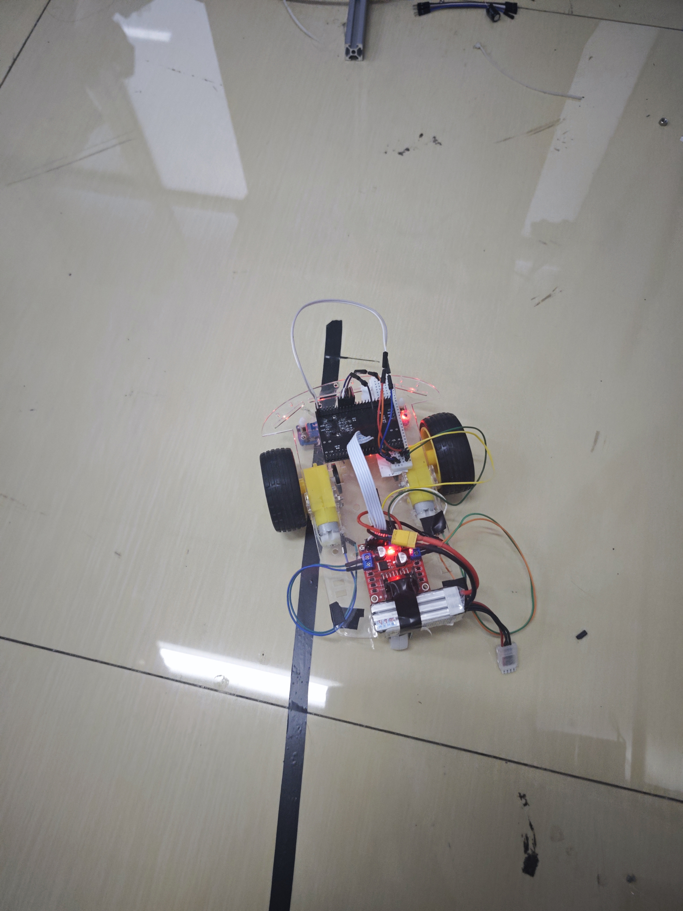
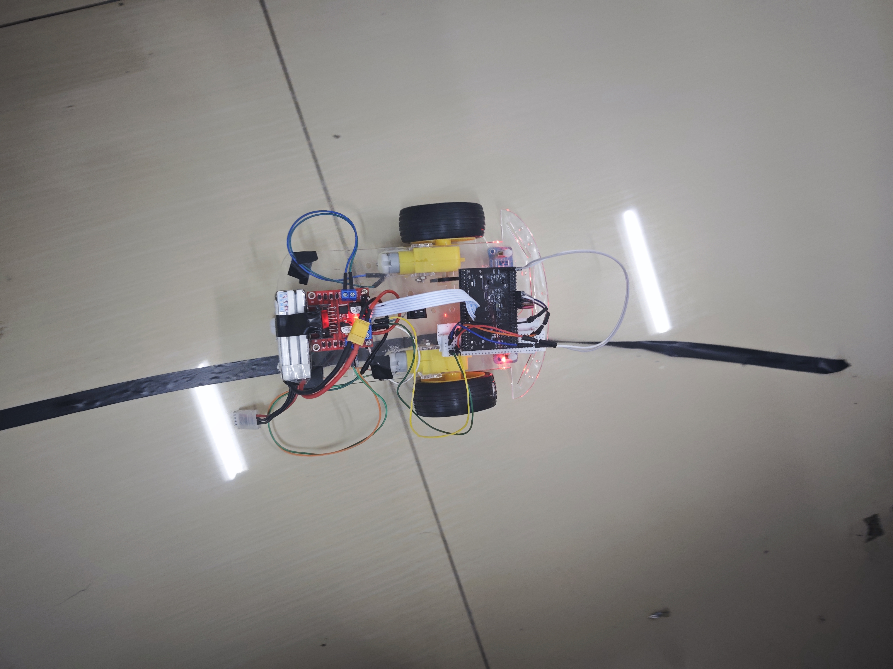
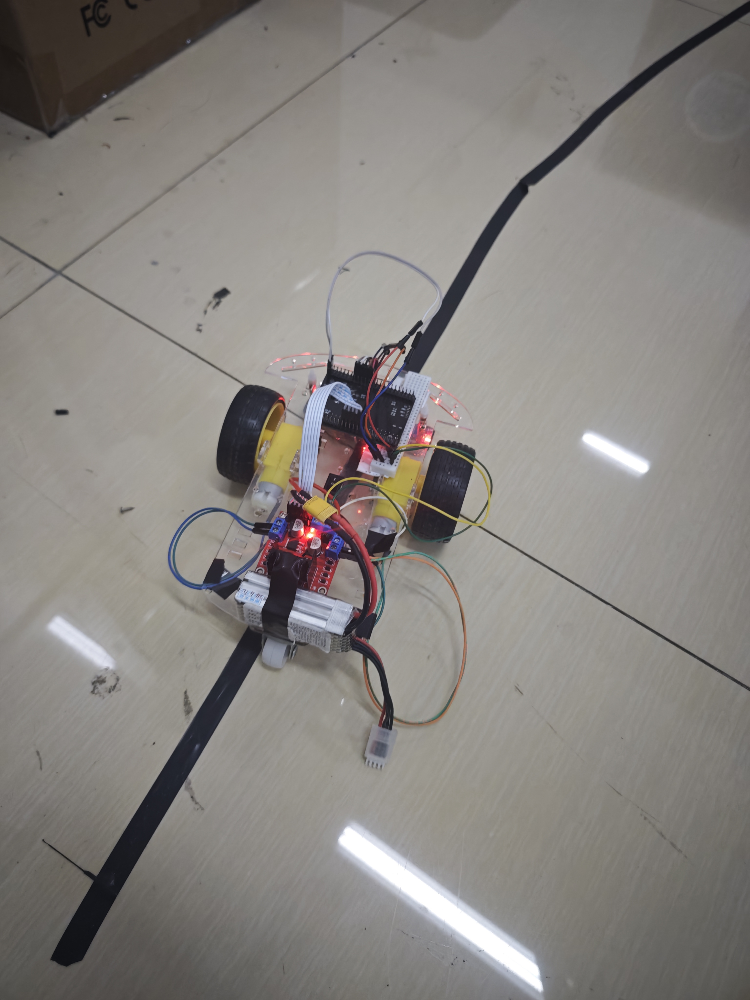

# CH32V307 红外循迹小车

第十七届全国大学生智能车竞赛项目。基于 CH32V307VCT6（RISC-V, 120MHz），5 路红外传感器 + P 比例控制差速转向。

<div align="center">
  
  <br>
  <em>小车循迹实拍</em>
</div>

## 项目说明

本项目基于逐飞科技 CH32V307 开源库进行开发，主要完成了红外循迹逻辑、电机 PWM 控制以及差速转向部分。`libraries/` 为第三方依赖（已精简至编译所需的最小集合），`project/user/` 为自行编写的核心代码。

已使用Claude code 进行 /init  方便读者进行理解


## 我写了什么

| 文件 | 内容 |
|------|------|
| `project/user/src/main.c` | 全部逻辑：初始化 + 寻迹控制循环 |
| `project/user/inc/infrared_tracking.h` | 寻迹模块数据结构设计 |

main.c 代码结构：

```
motor_init()       → PWM + GPIO 方向引脚初始化
ir_sensor_init()   → 5 路红外传感器初始化（上拉输入）
ir_get_error()     → 读传感器，查误差映射表，返回偏离值
main() while 循环  → error → 差速计算 → PWM 输出
```

误差映射（5 路传感器从左到右）：

```
传感器:  CH1(远左)  CH2(左)  CH3(中)  CH4(右)  CH5(远右)
误差:      -4        -2        0       +2        +4
```

偏离越远误差越大，转弯越急。丢线时保持上次方向。

调参：`KP=30`, `BASE_SPEED=3000`, PWM 满量程 10000。右电机 `+RIGHT_MOTOR_COMP(160)` 补偿硬件差异。

## 硬件接线

**红外传感器**（GPIO 输入上拉，低电平 = 检测到黑线）：

| CH1 | CH2 | CH3 | CH4 | CH5 |
|-----|-----|-----|-----|-----|
| PC6 | PC8 | PA8 | PA10 | PA12 |

**电机**（TIM5 PWM + GPIO 方向）：

| 左电机 PWM | 右电机 PWM | 左方向 | 右方向 |
|-----------|-----------|--------|--------|
| PA1 (TIM5_CH2) | PA3 (TIM5_CH4) | PA5/PA7 | PC5/PB1 |

CH32
├── TIM5 PWM → L298N → 左右电机
├── GPIO → 红外循迹模块
└── UART → 串口调试

**调试串口：** UART3 (PB10/PB11), 115200

<div align="center">
  
  <br>
  <em>正面视角 — 可见传感器模块（底部红色板）和 L298N 驱动板</em>
</div>

<div align="center">
  
  <br>
  <em>侧面视角 — 可见整体接线与电池供电</em>
</div>

## 目录结构

```
project/user/src/main.c          ← 你要看的代码在这里
project/user/inc/                 ← 用户头文件
libraries/                        ← 逐飞科技开源库（第三方，GPL 3.0）
  sdk/                            ← WCH CH32V307 官方 SDK
  zf_common/                      ← 时钟、调试、FIFO 等公共模块
  zf_driver/                      ← GPIO/PWM/UART 等底层驱动封装
  zf_device/                      ← 摄像头、无线等设备驱动（仅保留编译所需的）
```

## 编译

- **IDE：** MounRiver Studio（http://www.mounriver.com/）
- **导入：** `File → Import → Existing Projects into Workspace` → 选 `project/mrs/`
- **编译：** `Project → Build Project`
- **烧录：** WCH-Link 调试器，`Run → Debug`

## 调试中遇到的问题


**1. PWM 频率设置问题**
最初设置 10kHz 电机无法正常驱动，
考虑到L298N的性能限制，最后换到5000HZ 

**2. 两个电机转速不一样**
同一 PWM 占空比下小车跑偏。通过实车测试给右电机加了 +160 补偿值解决。（物理校准）

**3. 丢线 / 十字路口**
全白（冲出赛道）或全黑（十字路口）时保持上次 error 不变，小车按原方向继续走。

**4. 传感器边界跳变**
红外在黑白交界处会抖动，当前靠主循环速度自然消抖，没做显式滤波。是已知优化点。

## 可以改进的方向

- P → PID，加入编码器闭环
- 定时器中断周期采样，替代当前的全速轮询
- 实现 `infrared_tracking.h` 中已设计的数据结构，替换 main.c 中的手动读取

## 致谢

- [逐飞科技](https://seekfree.taobao.com/) — CH32V307 开源库
- [沁恒微电子](https://www.wch.cn/) — CH32V307 芯片及 SDK

`libraries/` 目录使用 GPL 3.0 协议。
